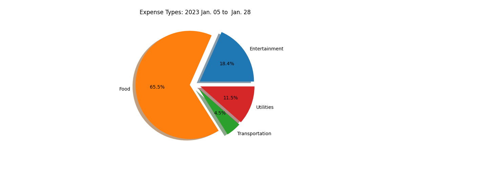

# MoneyWatcher

MoneyWatcher is a tool designed to personalize the categorization and sub-categorization of financial transactions. It is aimed at helping users analyze their spending patterns, create budget plans, receive warnings when budgets are exceeded, and receive suggestions for actions to get back on track in the following months.

## Features

- **PDF Statement Parsing:** MoneyWatcher is capable of extracting transaction data from PDF statements provided by banks, making it convenient for users to import their financial data. (COMPLETE)

- **Transaction Categorization:** MoneyWatcher allows users to categorize their transactions into different expense categories (e.g., Food, Entertainment) by suggesting common categories or allowing users to create new categories. (COMPLETE)

- **Sub-Categorization:** Users can further sub-categorize their transactions within each main category, providing a detailed breakdown of their expenses. (COMPLETE)

- **Budget Planning:** The tool assists users in creating budget plans based on their (sub) categorized transactions and historical spending patterns, helping them set financial goals and track their spending. (TODO)

- **Budget Reports:** MoneyWatcher sends reports of user spending over the last month and an end-of-year summary, providing awareness of spending and details to stay on top of their financial goals. (TODO)

- **Actionable Insights:** The tool suggests actionable insights and plans for the following months to help users adjust their spending and meet their financial objectives. (TODO)

*MoneyWatch currently only supports Scotiabank Visa Statements*

**Spending Categorization**

**Spending Sub-Categorization**

